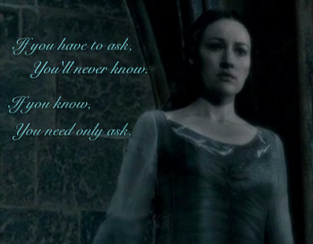

# 
F.A.Q.

## Welcome to our F.A.Q.!
If you're looking for information about the festival, the activities on the program or even 
~~the name of your favorite author's favorite color~~, this is the place to be!  
But whatever your question, remember to check that others haven't asked it before you.

> *If you have to ask, you'll never know. If you know, you need only ask.” Helena Serdaigle*

**Is admission to the festival free?**
Yes, totally! This first edition is organized by volunteers and, thanks to the support of the LiMon association (Librairies du Monde), we can offer you an experience on a human scale.  

**Where will the *Tide and Tales Bookfair* take place?**
Our first edition will take place at **Ateliers des Capucins, 25 Rue de Pontaniou, 29200 Brest**.  

**Will there be a second edition?**
We hope so! It all depends on you, our readers. If you like this first edition, we'd be delighted to organize a second, a third and so on!

**Will there be food stalls on site?**
Of course. The usual restaurateurs at Les Capucins will be happy to serve you. You'll also find other ephemeral stands of all kinds.  

**Which authors will be present at the festival?**
We'll be delighted to welcome Tiktok and Instagram literary content creators, as well as famous authors. For more information, please visit our [exhibitors] page (Exhibitors.md). It should satisfy your curiosity!

[Home](Index.md)|[Exhibitors](Exhibitors.md)|[Programming](Programming.md)|[About us](AboutUs.md)|[F.A.Q.](Ask.md)|[Find us](WhereTo.md)|[Site in French](index.md)
