# Exhibitors

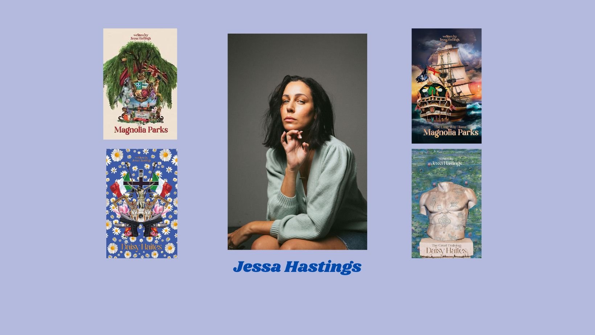

Born in Australia and now living in Southern California, Jessa Hastings is a bestselling romance author.
In 2021, she published her first novel *Magnolia Parks*, which gave its name to a series that became a TikTok sensation. It was followed by *Daisy Haites*(2021), *Magnolia Parks: The Long Way Home* (2022) and *Daisy Haites : The Great Undoing* (2022).

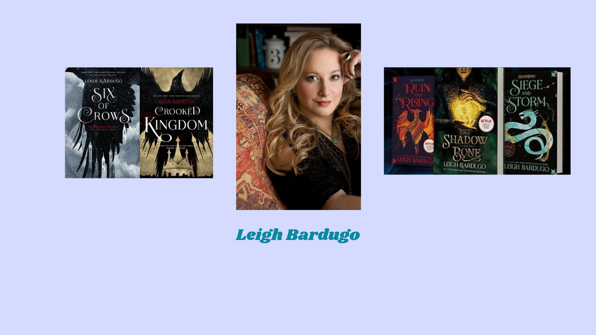
Leigh Bardugo, is an American author of young adult fantasy novels, best known for the duology *Six of Crows* and the trilogy *Shadows and Bones*, which have sold over two million copies.

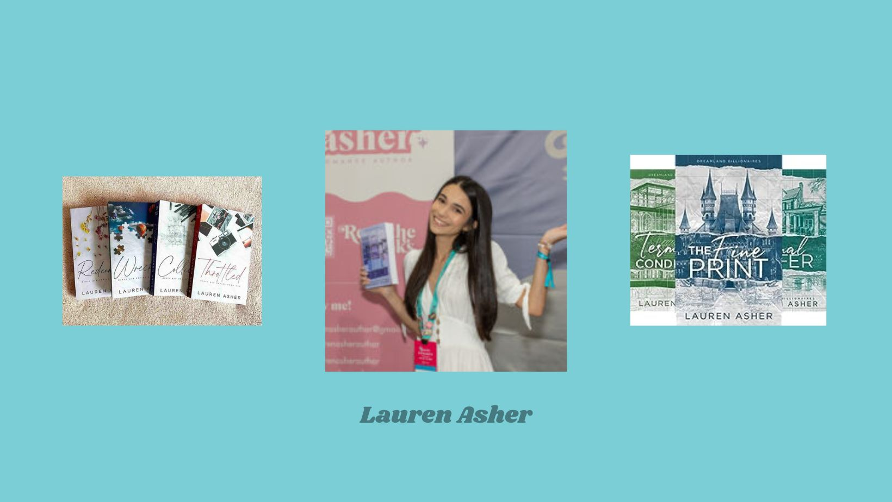
Lauren Asher is an award-winning contemporary romance author for *USA Today*, *Wall Street Journal*, *Sunday Times*, *Globe and Mail* and *Publishers Weekly*. Her best-loved romances are the Dreamland Billionaires series and Dirty Air.

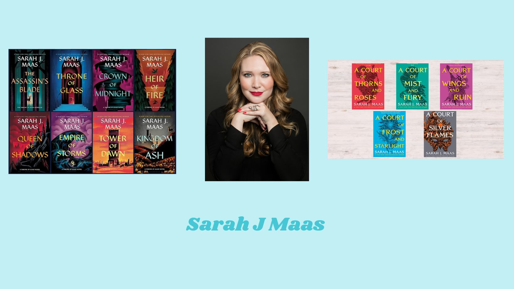
Sarah J. Maas is an American fanstasy author best known for the *Throne of Glass* and *A Court of Thorns and Roses* book series. In 2022, she sold over twelve million copies of her books, and her works have been translated into over 37 languages.

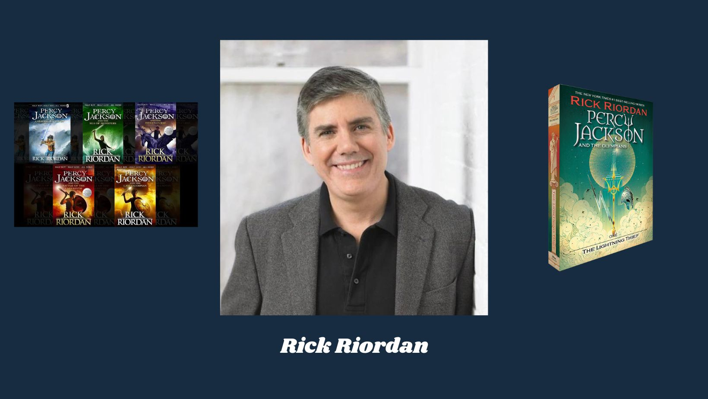

Richard Russell Riordan is the author of the acclaimed fantasy novels *Percy Jackson* and *Heroes of Olympus*. His books have been translated into over 42 languages, and he has sold over 30 million copies in the USA alone. Streaming platform Disney+ has had the *Percy Jackson* books adapted into a series and released in December 2023.

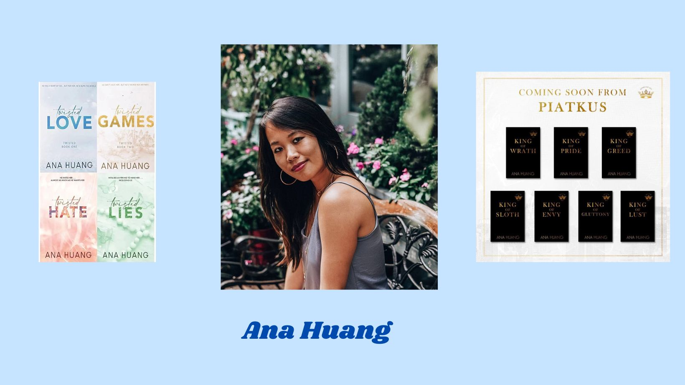
Ana Huang is a *USA Today* bestselling author and Amazon #1. Made famous by her Twisted series, she writes contemporary romances.

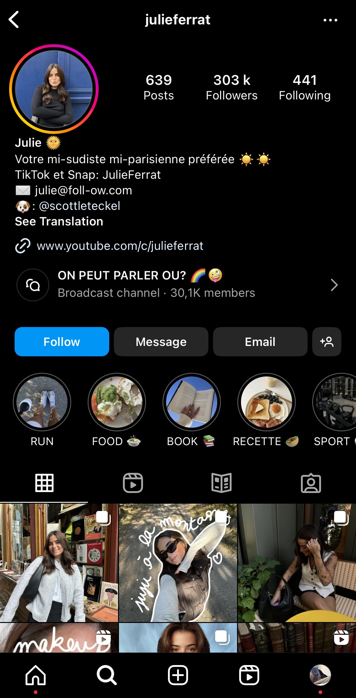
Julie Ferrat is a 20-year-old content creator who shares with her community her daily life in the South of France and her passions, especially reading.

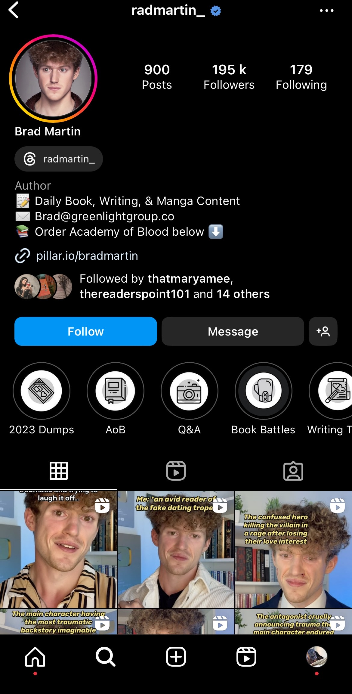
Content creator and author of the book *Academy of Blood*. His fame is due to his booktook videos.

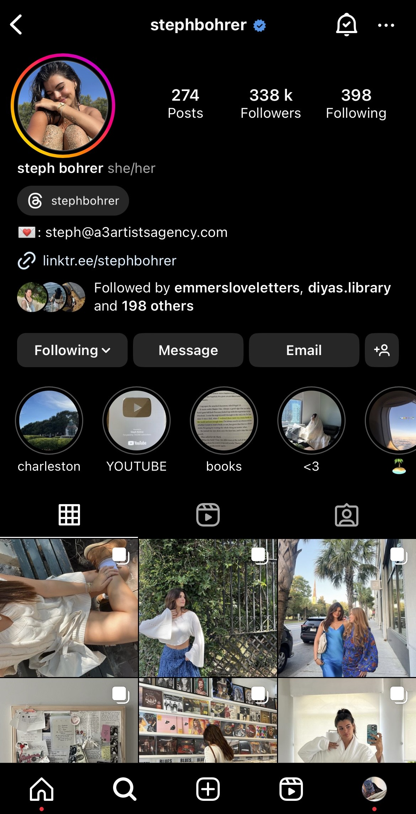
Steph Bohrer became famous on TikTok thanks to her comedy videos, which have earned her over 800,000 subscribers. She regularly publishes vlogs and lifestyle videos, as well as book recommendations on her Youtube channel.

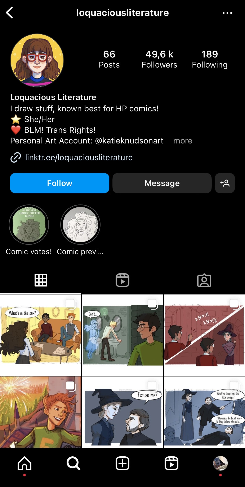
Lucy, aka @loquaciousliterature, is becoming famous thanks to her Tumblr blog and for her *comics* content on *Harry Potter*.

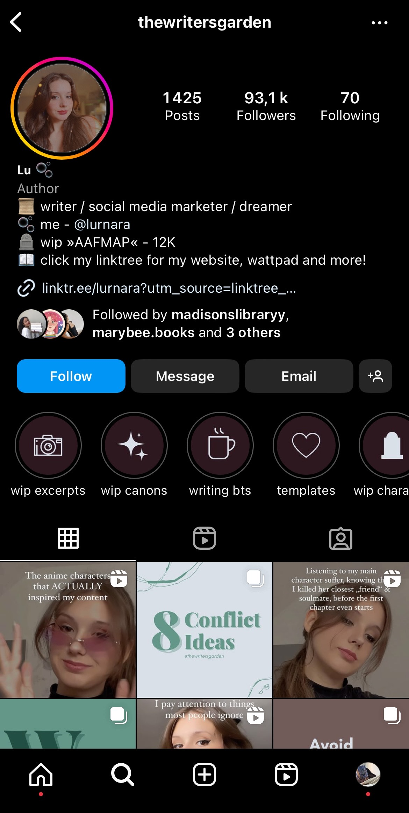
Lu, content creator and author followed by 90,000 people on Instagram, regularly publishes content and advice on the writing process.

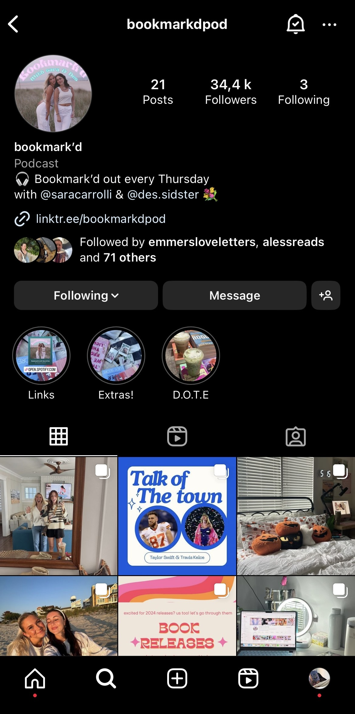
The Bookmark'dpod podcast is the duo of content creators Sara Carrolli and Destiny Sidwell, who release an episode every Thursday to talk about books.

[Home](Index.md)|[Exposants](Exhibitors.md)|[Programmation](Programming.md)|[About us](AboutUs.md)|[F.A.Q.](Ask.md)|[Find us](WhereTo.md)|[French site](index.md)
