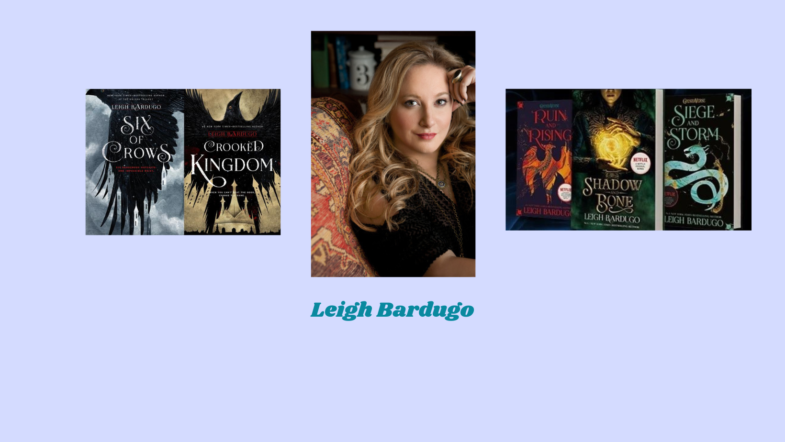

# Exposants

Née en Australie et vivant aujourd'hui en Californie du Sud, Jessa Hastings est une auteure de romance à succès.
En 2021, elle a publié son premier roman *Magnolia Parks*, le premier de la série, qui est devenu une sensation TikTok et a été suivi par *Daisy Haites*(2021), *Magnolia Parks: The Long Way Home* (2022) et *Daisy Haites : The Great Undoing* (2022).

Leigh Bardugo, est une autrice américaine de romans jeune adulte de fantasy, principalement connue pour la duologie *Six of Crows* et la trilogie *Shadow Bone*, qui se sont vendues à plus de deux millions d'exemplaires.

Lauren Asher est une auteure de romance contemporaine qui a été primée par *USA Today*, le *Wall Street Journal*, le *Sunday Times*, le *Globe and Mail* et *Publishers Weekly*. Ses romances les plus appréciées sont la série Dreamland Billionaires et Dirty Air.

[Home](index.md)|[Exposants](Exposants.md)|[Programmation](Programmation.md)|[À propos](Aboutus.md)|[F.A.Q.](Questions.md)|[Nous trouver](Whereto.md)
