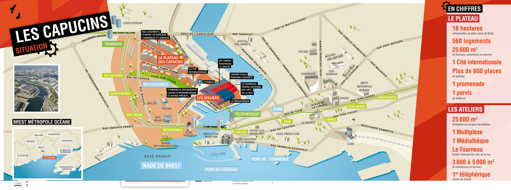

# Where To?

Le festival se déroulera aux Ateliers Les Capucins, voici un plan pour s'y rendre :

* vous pouvez vous y rendre en prenant le téléphérique et admirer la vue spectaculaire.
* vous pouvez vous y rendre en prenant le tramway de l'arrêt **Liberté** à l'arrêt **Les Capucins**.
  
Le festival se tiendra sur trois jours au rez-de-chaussé des Capucins :

[Home](index.md)|[Exposants](Exposants.md)|[Programmation](Programmation.md)|[À propos](Aboutus.md)|[F.A.Q.](Questions.md)|[Nous trouver](Whereto.md)
