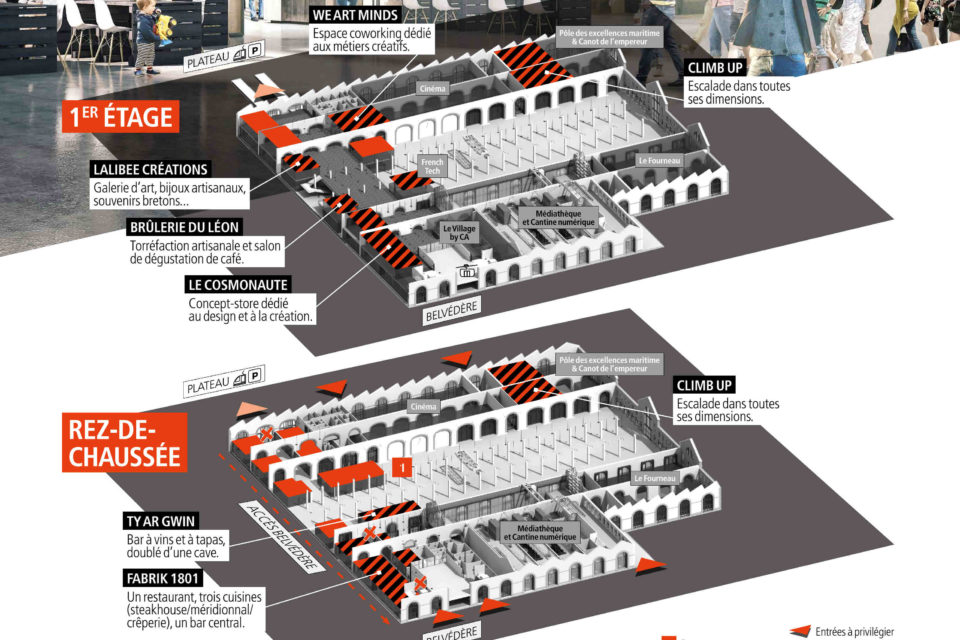

# Where To?

The festival will take place at Ateliers Les Capucins, here's a map to get there:

* You can get there by taking the cable car and admiring the spectacular view.
* You can also take the streetcar from the **Liberté** stop to the **Les Capucins** stop.
  
The festival will be held over three days on the ground floor of Les Capucins:

[Home](Index.md)|[Exhibitors](Exhibitors.md)|[Programming](Programming.md)|[About us](AboutUs.md)|[F.A.Q.](Ask.md)|[Find us](WhereTo.md)|[Site in French](../fr/index.md)
