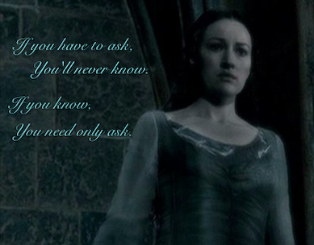

# 
F.A.Q.

## Bienvenue sur notre F.A.Q. !
Si vous cherchez des informations sur le festival, les activités au programme ou bien 
~~le nom de la couleur préférée de votre auteur favori~~, c'est ici qu'il faut vous trouver !  
Mais quelle que soit votre question, pensez à vérifier que d'autres ne l'ont pas posée avant vous.  

> *« Si vous devez demander, jamais vous ne saurez. Si vous savez, il vous suffit de demander. » Helena Serdaigle*

**L'accès au festival est-il gratuit ?**  
Oui, totalement ! Cette première édition est organisée par des bénévoles et, grâce au soutien de l'association LiMon (Librairies du Monde), nous pouvons vous offrir une expérience à taille humaine.  

**Où se déroulera le *Tide and Tales Bookfair* ?**  
Notre première édition aura lieu aux **Ateliers des Capucins, 25 Rue de Pontaniou, 29200 Brest**  

**Y aura-t-il une deuxième édition ?**  
Nous l'espérons ! Cela dépendra de vous, amis lecteurs. Si cette première édition vous plaît, nous serions ravies d'en organiser une deuxième, une troisième et tant d'autres !

**Y aura-t-il des stands de restauration sur place ?**  
Bien évidemment. Les restaurateurs habituellement présents aux Capucins seront heureux de vous servir. Vous trouverez également d'autres stands éphémères en tout genre.  

**Quels auteurs seront présents à ce festival ?**  
Nous aurons le plaisir d'accueillir des créateurs de contenus littéraires Tiktok et Instagram, ainsi que de célèbres auteurs. Pour de plus amples informations à ce sujet, je vous renvoie vers la page de nos [exposants](Exposants.md). Elle devrait satisfaire votre curiosité !

[Home](index.md)|[Exposants](Exposants.md)|[Programmation](Programmation.md)|[À propos](Aboutus.md)|[F.A.Q.](Ask.md)|[Nous trouver](Whereto.md)|[Site en anglais](../en/Index.md)
