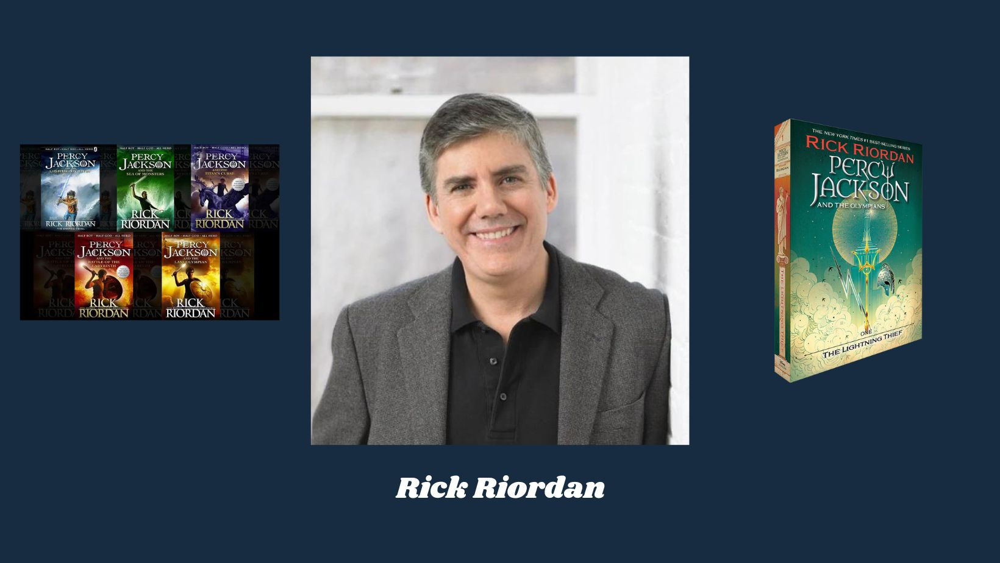
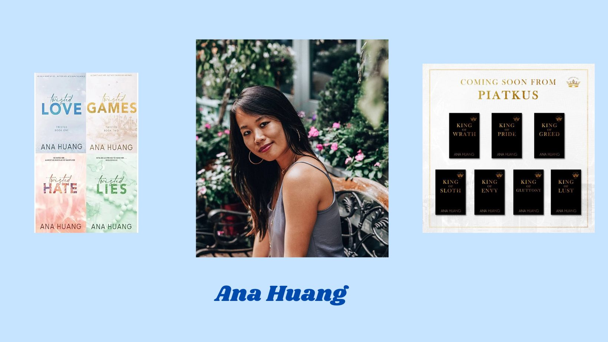
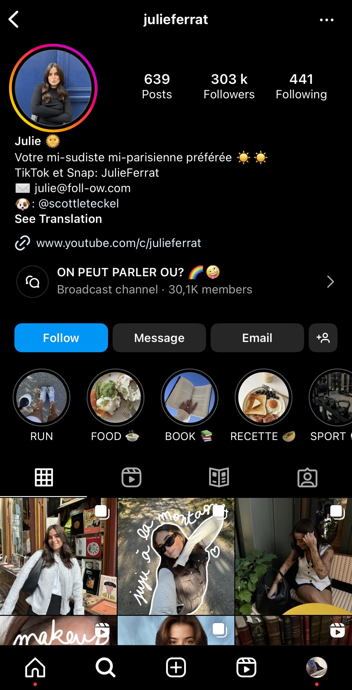
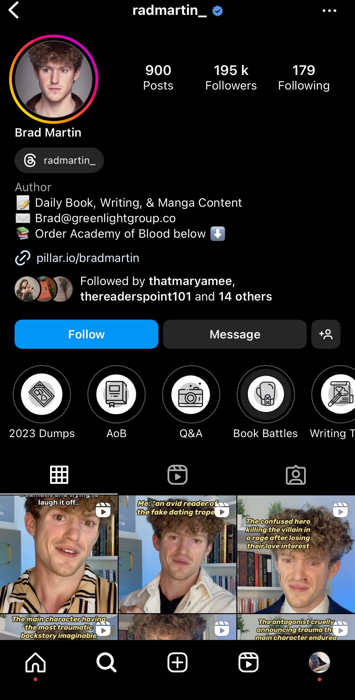
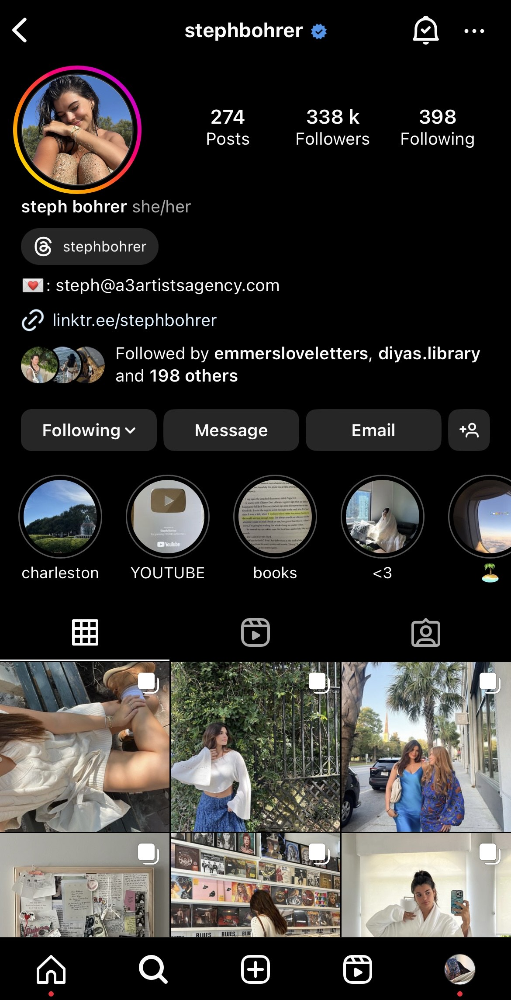
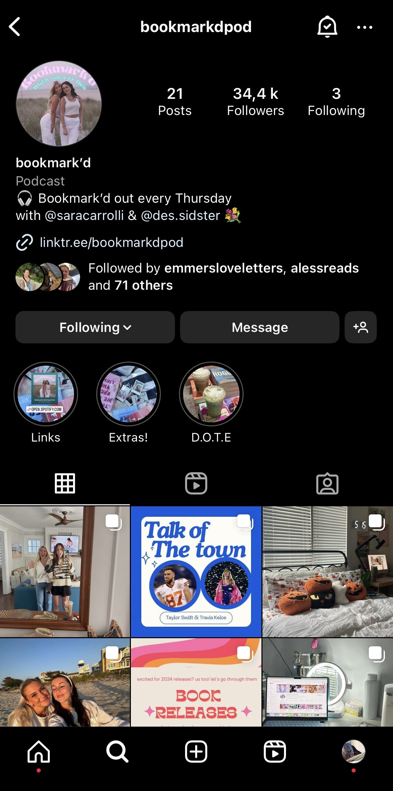

# Exposants

Nata in Australia e ora residente nel sud della California, Jessa Hastings è un'autrice di bestseller romance.
Nel 2021 ha pubblicato il suo romanzo d'esordio *Magnolia Parks*, che ha dato il nome a una serie diventata un fenomeno di TikTok. Ad esso sono seguiti *Daisy Haites* (2021), *Magnolia Parks: The Long Way Home* (2022) e *Daisy Haites : The Great Undoing* (2022).

Leigh Bardugo è un'autrice americana di romanzi fantasy per giovani adulti, nota soprattutto per la duologia *Six of Crows* e la trilogia *Shadows and Bones*, che hanno venduto oltre due milioni di copie.

Lauren Asher è un'autrice di romanzi contemporanei premiata da *USA Today*, *Wall Street Journal*, *Sunday Times*, *Globe and Mail* e *Publishers Weekly*. I suoi romanzi più amati sono la serie Dreamland Billionaires e Dirty Air.

Sarah J. Maas è un'autrice americana di fanstasy nota soprattutto per le serie di libri *Throne of Glass* e *A Court Of Thorns And Roses*. Nel 2022 ha venduto oltre dodici milioni di copie dei suoi libri e le sue opere sono state tradotte in oltre 37 lingue.

Richard Russell Riordan è l'autore degli acclamati romanzi fantasy *Percy Jackson* e *Eroi dell'Olimpo*. I suoi libri sono stati tradotti in oltre 42 lingue e hanno venduto oltre 30 milioni di copie solo negli Stati Uniti. La piattaforma di streaming Disney+ ha fatto adattare i libri di *Percy Jackson* in una serie che uscirà nel dicembre 2023.

Ana Huang è un'autrice di bestseller *USA Today* e numero uno di Amazon. Resa famosa dalla serie Twisted, scrive romanzi contemporanei.

Julie Ferrat è una content creator di 20 anni che condivide con la sua community la sua vita quotidiana nel sud della Francia e le sue passioni, in particolare la lettura.

Creatore di contenuti e autore del libro *Academy Of Blood*. La sua fama è dovuta ai video booktok.

Steph Bohrer è diventata famosa su TikTok grazie ai suoi video comici, che le hanno fatto guadagnare oltre 800.000 abbonati. Sul suo canale YouTube pubblica regolarmente vlog e video di lifestyle, oltre a consigli di libri.

Lucy, alias @loquaciousliterature, sta diventando famosa per il suo blog su Tumblr e per i suoi contenuti *comici* su *Harry Potter*.

Lu, content creator e autrice seguito da 90.000 persone su Instagram, pubblica regolarmente contenuti e consigli sul processo di scrittura.

Il podcast Bookmark'dpod nasce da un'idea delle creatrici di contenuti Sara Carrolli e Destiny Sidwell, che ogni giovedì pubblicano un episodio per parlare di libri.

[Home](index.md)|[Standisti](Exposants.md)|[Programmazione](Programmation.md)|[Chi siamo](Aboutus.md)|[F.A.Q.](Questions.md)|[Trovarci](Whereto.md)|[Site en anglais](../en/Exhibitors.md)|[Sito in francese](../fr/Exposants.md)
