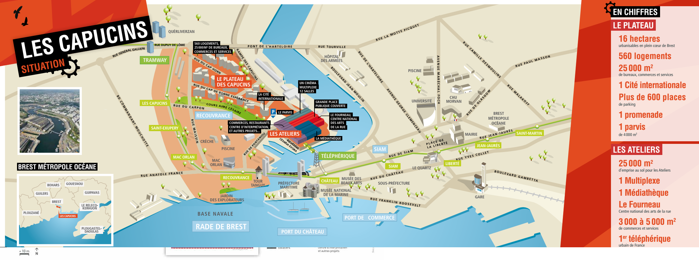
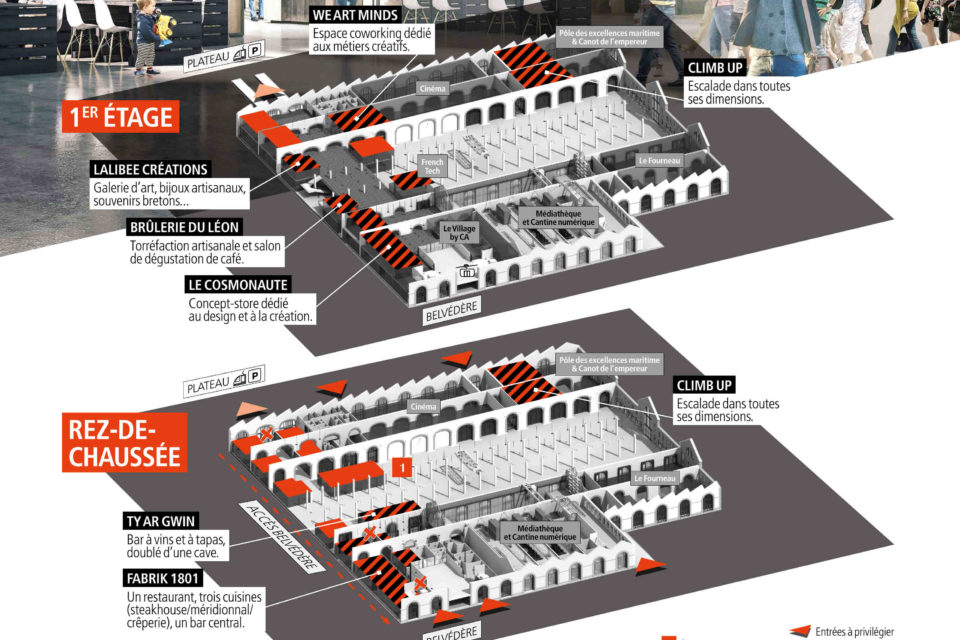

# Where To?

Le festival se déroulera aux Ateliers Les Capucins, voici un plan pour s'y rendre :

* vous pouvez vous y rendre en prenant le téléphérique et admirer la vue spectaculaire.
* vous pouvez vous y rendre en prenant le tramway de l'arrêt **Liberté** à l'arrêt **Les Capucins**.
  
Le festival se tiendra sur trois jours au rez-de-chaussé des Capucins :

[Home](index.md)|[Standisti](Exposants.md)|[Programmazione](Programmation.md)|[Chi siamo](Aboutus.md)|[F.A.Q.](Questions.md)|[Trovarci](Whereto.md)|[Sito in francese](../it/Whereto.md)
