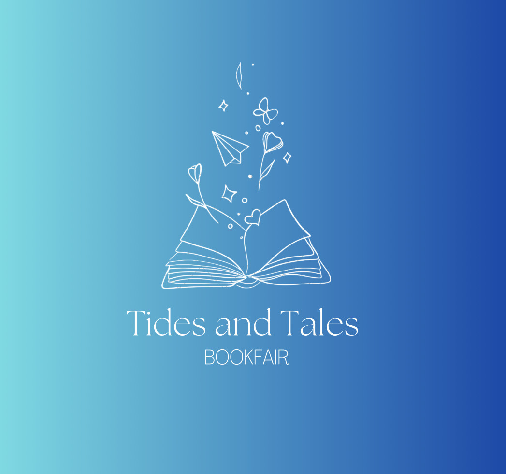
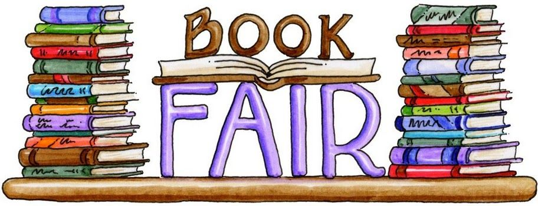

# Tide and Tales Bookfair
## Prima edizione del festival del libro Tide and Tales

 

Ciao e benvenuti alla Fiera del Libro Tide and Tales! Benvenuti alla prima edizione a Brest della Fiera del Libro Tide and Tales, l'imperdibile evento letterario dell'anno. Dal 20 al 22 settembre 2024, immergetevi gratuitamente nel mondo del romanticismo e del fantasy! 
 

Il nostro variegato programma prevede vivaci discussioni, sessioni di autografi con i vostri autori preferiti e un concorso con tanti premi in palio!

Incontrate scrittori di romanzi e fantasy come Ana Huang e Rick Riordan, chiacchierate con i creatori di contenuti di bookstagram e booktok come @wintersgarden o @julieferrat e ponete le vostre domande raggiungendo i vostri autori o creatori di contenuti preferiti nei loro stand durante la giornata.

Esplorate Les Capucins, il sito del festival, e scoprite le ultime pubblicazioni, i tesori letterari nascosti e non esitate a chiedere consigli sui libri.

**INFORMAZIONI PRATICHE**

* Date: Dal 20 al 24 settembre 2024.
* Luogo: Les Capucins, Brest.

Unitevi a noi per celebrare la magia delle parole e delle storie. Insieme, creiamo ricordi letterari indimenticabili. Saremo lieti di darvi il benvenuto alla Fiera del Libro Tides and Tales!

[Home](index.md)|[Exposants](Exposants.md)|[Programmation](Programmation.md)|[À propos](Aboutus.md)|[F.A.Q.](Questions.md)|[Nous trouver](Whereto.md)|[Sito in francese](../fr/index.md)
